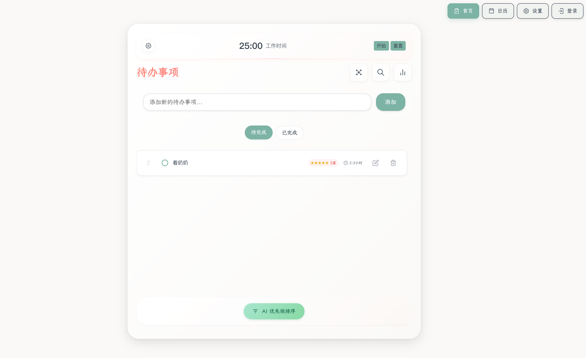

# Yun AI TodoList

一个智能的待办事项管理工具，帮你更好地规划工作和生活。



## 为什么做这个项目

最开始只是想给自己做一个更好用的待办清单，后来慢慢加入了一些 AI 功能，比如让 AI 帮我分析任务优先级、给出完成建议等。现在它已经能支持 Web 和桌面端了。

## 主要功能

- **智能任务管理** - 支持拖拽排序、优先级标记、子任务
- **AI 助手** - 帮你分析任务、给出完成建议、估算时间
- **多端同步** - Web、Windows、macOS、Linux 都能用，数据实时同步
- **数据分析** - 看看你的任务完成率、时间都花在哪了
- **离线使用** - 没网也能用，有网自动同步

## 技术实现

这个项目用了一些我比较熟悉的技术：

**前端：** Vue 3 + TypeScript，用 Vite 构建，样式方案使用 UnoCSS + 自定义CSS
**后端：** NestJS + PostgreSQL，API 文档用 Swagger **桌面端：**
Electron 打包成原生应用 **部署：** Docker 容器化，支持一键部署

## 快速开始

### 最简单的方式（推荐）

```bash
# 克隆项目
git clone https://github.com/yunmu/yun-ai-todolist.git
cd yun-ai-todolist

# 复制环境变量配置
cp .env.example .env
# 编辑 .env 文件，填一下数据库和 AI API 的密钥

# 一键启动
docker-compose up -d
```

访问 http://localhost:5173 就能用了。

### 本地开发

```bash
# 安装依赖
pnpm install

# 启动数据库（用 Docker）
docker run -d --name postgres-todo -e POSTGRES_DB=yun_todo_db -e POSTGRES_USER=yun_todo_user -e POSTGRES_PASSWORD=postgres123 -p 5432:5432 postgres:13

# 启动服务
pnpm dev:all
```

## 项目结构

```
yun-ai-todolist/
├── apps/
│   ├── frontend/     # Vue 3 前端
│   └── backend/      # NestJS 后端
├── packages/
│   └── shared/       # 前后端共享代码
├── electron/         # 桌面应用配置
└── scripts/          # 各种脚本
```

## 部署

### 生产环境

```bash
# 构建生产镜像
docker-compose -f docker-compose.prod.yml build

# 启动
docker-compose -f docker-compose.prod.yml up -d
```

### 桌面应用

```bash
# 构建桌面应用
pnpm electron:build
```

构建好的应用会在 dist_electron 目录里。

## 开发相关

### 运行测试

```bash
# 单元测试
pnpm test

# E2E 测试
pnpm test:e2e
```

### 代码规范

项目用了 ESLint + Prettier 自动格式化，提交代码前会跑检查。

```bash
# 手动格式化
pnpm format

# 检查代码
pnpm lint
```

## 贡献代码

欢迎贡献！发现 bug 或者有新想法可以直接提 issue 或 PR。

1. Fork 项目
2. 创建分支 (`git checkout -b feature/AmazingFeature`)
3. 提交修改 (`git commit -m 'Add some AmazingFeature'`)
4. 推送分支 (`git push origin feature/AmazingFeature`)
5. 开 Pull Request

## License

GPL-3.0 License - 详见 [LICENSE](LICENSE) 文件

## 联系我

有问题或建议可以：

- 提 [GitHub Issue](https://github.com/yunmu/yun-ai-todolist/issues)
- 给我发邮件（在 GitHub 主页有）

如果这个项目对你有帮助，给个 star 吧 ⭐
